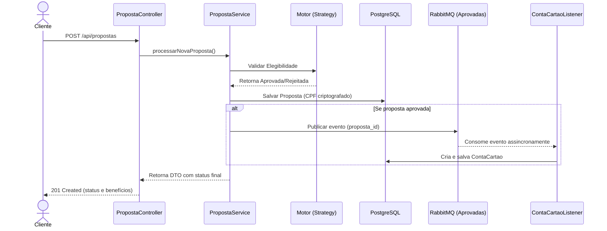

# 💳 BTG Cards Service - Desafio Técnico DOMVS iT


API REST desenvolvida como parte do desafio técnico para a vaga de Desenvolvedor Java.
O microsserviço orquestra o fluxo de solicitação de cartões de crédito, validando regras de negócio, persistindo dados de forma segura e emitindo eventos assíncronos para criação efetiva de contas.

---

## 🏗️ Arquitetura e Fluxo de Dados

Diagrama de sequência do fluxo principal da aplicação, evidenciando o isolamento de responsabilidades e a comunicação assíncrona:



## 🛡️ Diferenciais Técnicos e Segurança

- **Design Patterns:** utilização do padrão Strategy (`RegraElegibilidade`) para o motor de regras das ofertas, permitindo criação de novas ofertas sem alterar o serviço principal (princípio Open/Closed do SOLID).
- **Segurança e LGPD (Data Masking):** o CPF, dado sensível, nunca é salvo em texto puro. Foi implementado um `AttributeConverter` (JPA) com criptografia AES para persistir o dado cifrado e descriptografá-lo apenas em runtime.
- **Mensageria (Event-Driven):** integração com RabbitMQ. O serviço de propostas não bloqueia a resposta aguardando criação da conta; um evento é publicado e consumido de forma assíncrona por `ContaCartaoListener`.
- **Tratamento Global de Exceções:** uso de `@RestControllerAdvice` para capturar exceções de validação (`@Valid`, `@CPF`) e regras de negócio, padronizando erros da API (Fail-Fast) e evitando vazamento de stack traces.
- **Testes Automatizados:** cobertura de testes unitários para serviços e regras de negócio usando JUnit 5 e Mockito.

## ⚙️ Regras de Negócio Implementadas

### Critérios de Elegibilidade

- **Oferta A:** renda > R$ 1.000,00
- **Oferta B:** renda > R$ 15.000,00 e investimentos > R$ 5.000,00
- **Oferta C:** renda > R$ 50.000,00 e tempo de conta corrente > 2 anos

### Restrições de Benefícios

- `CASHBACK` e `PONTOS` são mutuamente exclusivos.
- `SEGURO_VIAGEM` é exclusivo da Oferta C.
- `SALA_VIP` é exclusivo das Ofertas B e C.

## 🚀 Como Executar o Projeto

### Pré-requisitos

- Java 21
- Maven
- Docker

### 1. Subir a infraestrutura (banco de dados e mensageria)

Na raiz do projeto:

```bash
docker compose up -d
```

### 2. Rodar a aplicação Spring Boot

```bash
./mvnw clean spring-boot:run
```

O Hibernate criará as tabelas no PostgreSQL automaticamente.

### 3. Executar os testes unitários

```bash
./mvnw test
```

## 📖 Documentação da API

Com a aplicação em execução, acesse a documentação interativa (Swagger UI):

👉 http://localhost:8080/swagger-ui/index.html

### Endpoint principal

`POST /api/propostas`

Cria e analisa uma nova proposta de cartão de crédito.

### Exemplo de request (cenário de aprovação - Oferta C)

```json
{
  "cpf": "06236683056",
  "nome": "Matheus Kormann",
  "renda": 55000.00,
  "investimentos": 10000.00,
  "tempoContaCorrenteAnos": 3,
  "ofertaSelecionada": "OFERTA_C",
  "beneficiosSelecionados": ["SALA_VIP", "SEGURO_VIAGEM"]
}
```

### Exemplo de response (201 Created)

```json
{
  "id": "84e8ef21-e52a-4873-b776-55e3c63e4c90",
  "ofertaSelecionada": "OFERTA_C",
  "beneficiosAtivos": ["SALA_VIP", "SEGURO_VIAGEM"],
  "status": "APROVADA"
}
```

### Exemplo de response (400 Bad Request - erro de validação)

```json
{
  "timestamp": "2026-03-16T02:17:58.413",
  "status": 400,
  "erro": "Dados inválidos na requisição",
  "detalhes": [
    "cpf: Formato de CPF inválido."
  ]
}
```
